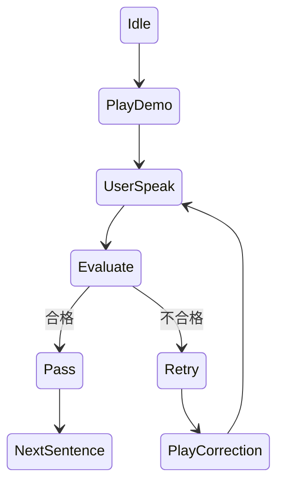

下面是**《我要练习的口语（I want to practice spoken English）》——技术团队用 PRD（Product Requirement Document）**。  
该版本**面向工程实现**，强调：**多模态直接听说、实时语音交互、可插拔 LLM、自定义模型配置 + 可用性检测 + 持久化**，可直接进入研发阶段。

---

# 产品需求文档（PRD｜技术版）

## 1. 产品概述

### 1.1 产品定位

一个**基于多模态 AI 的强制闭环口语练习系统**，以「听 → 说 → 判定 → 纠正 → 再练」为核心循环，**不合格不放行**，直到用户完成全部自定义短句练习。

### 1.2 核心原则（技术必须遵守）

1. **直接语音交互（Speech-first）**
    
2. **多模态模型负责理解 + 反馈（不是拼接多个弱模块）**
    
3. **LLM 完全可配置、可替换**
    
4. **状态可恢复、流程可控**
    
5. **判定逻辑由 AI + 规则共同完成**
    

---

## 2. 用户与使用方式（技术视角）

### 2.1 用户操作流程

1. 上传 / 编辑 `I want to practice spoken English.txt`
    
2. 配置或选择 LLM（提供商 / endpoint / model）
    
3. 点击「开始练习」
    
4. 全程语音互动
    
5. 全部句子合格 → 完成
    

---

## 3. 系统整体架构（逻辑）

```
Frontend (Web / App)
│
├─ Audio Capture (Mic)
├─ Audio Playback (AI Voice)
│
└─ Session Controller
      │
      ▼
Backend API
│
├─ LLM Adapter Layer  ←【核心】
│     ├─ OpenAI / Azure / Local / Custom
│     └─ Multimodal Inference
│
├─ Speech Pipeline
│     ├─ Input Audio → LLM
│     └─ Output Audio + Text
│
├─ Pronunciation Evaluation Engine
│
├─ State Machine (练习进度)
│
└─ Persistence (Config / Progress)
```

---

## 4. 多模态语音交互设计（核心）

### 4.1 强制要求

- **必须使用支持 Audio In + Audio Out 的多模态模型**
    
- 不允许：
    
    - 纯 STT → LLM → TTS 的弱拼接（第一期）
        
- 模型需具备：
    
    - 语音理解
        
    - 发音质量判断
        
    - 自然语言反馈生成
        

---

### 4.2 单句练习状态机



---

## 5. 输入文件处理（txt）

### 5.1 文件约定

- 文件名固定：
    
    ```
    I want to practice spoken English.txt
    ```
    
- UTF-8 编码
    
- 每行一个练习句
    

### 5.2 后端解析

```json
{
  "sentences": [
    {
      "id": 1,
      "text": "I want to practice spoken English.",
      "status": "pending"
    }
  ]
}
```

---

## 6. LLM 可配置系统（重点）

### 6.1 设计目标

用户可 **完全自定义 AI 模型来源**，系统只负责：

- 调用
    
- 校验
    
- 统一接口
    
- 安全存储
    

---

### 6.2 模型配置字段（必做）

```json
{
  "provider": "openai | azure | local | custom",
  "endpoint": "https://api.xxx.com/v1",
  "apiKey": "********",
  "model": "gpt-4o-realtime-preview",
  "supportsAudioIn": true,
  "supportsAudioOut": true,
  "maxLatencyMs": 3000
}
```

---

### 6.3 模型可用性检测（Model Health Check）

#### 触发方式

- 用户点击「测试模型」
    
- 保存配置前自动检测
    

#### 检测流程

1. 发送最小多模态请求：
    
    - 1 秒测试音频
        
    - 简单指令（如：“Repeat this sentence”）
        
2. 校验：
    
    - HTTP 状态
        
    - 响应时间
        
    - 是否返回音频
        
    - 是否理解指令
        

#### 返回示例

```json
{
  "status": "available",
  "latencyMs": 820,
  "audioIn": true,
  "audioOut": true,
  "message": "Model is ready for practice."
}
```

---

### 6.4 模型配置保存

- 加密存储 API Key
    
- 支持多个模型配置
    
- 支持切换「当前使用模型」
    

---

## 7. 多模态 Prompt（系统级）

### 7.1 系统 Prompt（固定，不可被用户修改）

> You are a native English speaking pronunciation coach.  
> You must listen carefully to the user's speech and decide whether it is natural, clear, and understandable to a native speaker.  
> If it is not acceptable, you must clearly explain why and guide the user to retry.  
> Do not allow the session to continue unless the pronunciation is acceptable.

---

## 8. 发音评估与合格判定

### 8.1 评估维度（AI 必须输出）

```json
{
  "phonemes": "ok | weak | wrong",
  "stress": "natural | unnatural",
  "intonation": "natural | flat | incorrect",
  "overall": "pass | almost | fail"
}
```

---

### 8.2 判定规则（系统层）

- `pass` → 进入下一句
    
- `almost` → 强制再练 1 次
    
- `fail` → 必须纠正
    

---

## 9. 语音反馈生成规则

### 9.1 AI 输出结构（强约束）

```json
{
  "feedbackText": "...",
  "feedbackAudio": "base64-audio",
  "action": "retry | next"
}
```

---

## 10. 会话与进度管理

### 10.1 Session State

```json
{
  "currentSentenceId": 3,
  "attempts": 2,
  "passedSentences": [1,2],
  "modelConfigId": "openai-001"
}
```

### 10.2 中断恢复

- 刷新 / 断线 → 回到当前句
    
- 不允许跳句
    

---

## 11. 非功能性要求

### 11.1 性能

- 语音往返 < 3 秒（理想 < 2 秒）
    
- 并发：按 session 隔离
    

### 11.2 安全

- API Key 不可前端直传
    
- HTTPS 强制
    
- 日志不存用户语音原文（可选匿名）
    

---

## 12. MVP 必须交付清单（技术）

✅ 多模态实时语音交互  
✅ txt 句子驱动练习  
✅ 不合格不放行  
✅ 自定义 LLM 配置  
✅ 模型可用性检测  
✅ 配置保存 + 切换  
✅ 会话进度管理

---

## 13. 一句话工程目标

> **让 AI 像一个真正的母语陪练，用耳朵“听懂你”，用嘴“纠正你”，直到你真的说对。**

下面是在**不改变前述 PRD 核心架构**的前提下，**面向技术团队补充的「移动端优化 + PWA 实现要求」增强章节**。
你可以将以下内容**直接并入 PRD**，作为 **第 14–16 章**。

---

# PRD 补充章节｜移动端优化 & PWA（技术必读）

> 目标：**第一天就能在手机上用**，不等原生 App，不牺牲多模态听说体验。

---

## 14. 移动端优先（Mobile-first）设计原则

### 14.1 核心原则

* **手机是第一使用场景**
* 单手操作
* 全流程围绕「戴耳机 + 说话」

### 14.2 设计硬性约束

| 项目 | 要求          |
| -- | ----------- |
| 屏幕 | 375px 起适配   |
| 操作 | 单主按钮交互      |
| 文本 | 大字号，低干扰     |
| 反馈 | 语音为主，文字为辅   |
| 打断 | 来电 / 切后台可恢复 |

---

## 15. PWA（Progressive Web App）实施要求

### 15.1 PWA 目标

* **无需 App Store**
* 一键「添加到主屏幕」
* 接近原生语音体验
* 快速 MVP & 迭代

---

### 15.2 必须支持的 PWA 能力

#### 1️⃣ 安装能力

* `manifest.json`
* 支持：

  * App Name
  * Icon（多尺寸）
  * Splash Screen
  * Standalone 模式

```json
{
  "name": "Spoken English Practice",
  "short_name": "Speak English",
  "display": "standalone",
  "orientation": "portrait",
  "icons": [
    { "src": "/icon-192.png", "sizes": "192x192" },
    { "src": "/icon-512.png", "sizes": "512x512" }
  ]
}
```

---

#### 2️⃣ 麦克风权限（关键）

* 首次进入强制引导授权
* 权限被拒必须有 fallback 提示
* iOS Safari 特别处理（用户交互触发）

---

#### 3️⃣ 后台/锁屏容错

* 锁屏 / 切 App → Session 保留
* 回到前台 → 自动恢复当前句

---

### 15.3 Service Worker（轻量）

**第一期要求：**

* 缓存静态资源
* 不缓存语音内容（隐私 + 体积）

---

## 16. 移动端语音交互专项设计（非常关键）

### 16.1 语音输入（Mic）

#### 技术要求

* Web Audio API
* 16k / 44.1k 采样率（模型可配）
* 支持：

  * Push-to-talk（按住说）
  * Tap-to-talk（点一下）

#### UX 推荐（强）

* 默认「点一下开始说」
* 明显录音态动画
* 最大录音时长限制（如 8 秒）

---

### 16.2 AI 语音输出（TTS / Audio Out）

* 必须：

  * 自动播放
  * 耳机优先
* 禁止：

  * 用户反复点击播放（破坏沉浸）

---

## 17. 移动端练习流程（简化但更强）

### 单句交互（移动端）

```
AI 示范朗读（自动播放）
↓
【大按钮】“我准备好了”
↓
录音中（动画）
↓
AI 分析 + 反馈（语音）
↓
✅ 合格 → 自动进入下一句
❌ 不合格 → 自动引导重练
```

---

## 18. 移动端 UI 组件清单（MVP）

### 18.1 必须组件

* 🎙 录音按钮（主 CTA）
* 🔊 AI 播放状态指示
* 📍 当前句子显示
* ⏳ 尝试次数提示（非压力）
* ✅ / 🔁 状态提示（极简）

---

## 19. 移动端状态管理（增强）

### 19.1 Session 本地持久化

* IndexedDB / LocalStorage
* 保存：

  * 当前句索引
  * 尝试次数
  * 模型配置 ID

### 19.2 网络波动处理

* 断网：

  * 阻止新录音
  * 提示「网络恢复后继续」

---

## 20. 技术选型建议（非强制，但推荐）

### 20.1 前端

* React + Vite / Next.js（PWA）
* Tailwind（移动优先）
* Web Audio API

### 20.2 通信

* WebSocket（语音）
* HTTPS + Token

---

## 21. PWA MVP 边界（明确不做）

* ❌ 离线语音识别
* ❌ 后台常驻录音
* ❌ 推送通知（第一期）

---

## 22. 技术团队一句话目标（移动端）

> **让用户像接电话一样练口语：戴上耳机，说话，立刻被纠正。**

---

## 23. 当前 PRD 已覆盖能力总结

✅ 多模态直接听说
✅ 强制闭环练习
✅ 用户自定义 LLM（提供商 / 模型 / endpoint）
✅ 模型可用性检测 + 保存
✅ Session 可恢复
✅ 移动端优先
✅ PWA 快速交付


重要的**强化并规范**三个按钮：

> **「设置（⚙ LLM 配置）」  
> 「编辑（✏️ 练习内容）」  
> 「帮助（❓ GitHub）」**

本章节遵循三条工程硬约束：  
**不破坏练习主流程｜移动端优先｜PWA 可实施**

---

# PRD 补充｜功能按钮设计与实现规范

## 1. 设计总原则（强约束）

1. **练习态页面只允许一个主 CTA：🎙 语音练习**
    
2. 设置 / 编辑 / 帮助 **不得出现在主交互区域**
    
3. 所有非练习操作 **必须中断当前练习 Session**
    
4. 移动端单手可达，但**不在拇指热区**
    

---

## 2. 全局布局规范（固定）

### 2.1 顶部功能栏（Top Utility Bar）

```
┌──────────────────────────┐
│  ☰                ❓     │
└──────────────────────────┘
```

- **左侧 ☰**：系统功能入口（设置 / 编辑）
    
- **右侧 ❓**：帮助 / GitHub
    
- 高度：44–48px
    
- 练习态下：弱化或禁用
    

---

## 3.「设置」——LLM 配置（⚙）

### 3.1 入口位置

- 顶部左侧 ☰ 菜单 → 一级项  
    `语言模型设置 ⚙`
    

---

### 3.2 功能范围（必须支持）

**模型配置**

- LLM Provider（下拉）
    
- Endpoint（URL）
    
- Model Name
    
- API Key（加密存储）
    

**模型能力标识**

- Audio In 支持（bool）
    
- Audio Out 支持（bool）
    

**操作**

- 【测试模型】
    
- 【保存并设为当前】
    

---

### 3.3 模型可用性检测（强制）

点击【测试模型】时：

1. 发送最小多模态请求（音频 + 指令）
    
2. 校验：
    
    - 连通性
        
    - 延迟
        
    - 是否返回音频
        
3. 返回明确状态：
    

```json
{
  "status": "available | unavailable",
  "latencyMs": 900
}
```

❌ **不可通过检测的模型禁止保存**

---

### 3.4 练习中修改规则（强约束）

- 若当前有未完成练习：
    
    - 弹窗提示：
        
        > “修改模型将中断当前练习，是否继续？”
        
- 确认后：
    
    - 清空 Session
        
    - 返回起始状态
        

---

## 4.「编辑」——练习内容（✏️）

### 4.1 入口位置（必须二级）

```
☰
 ├─ 编辑练习内容 ✏️
 └─ 语言模型设置 ⚙
```

❌ 禁止独立图标  
❌ 禁止出现在练习主界面

---

### 4.2 功能范围（MVP）

- 编辑 `I want to practice spoken English.txt`
    
- 支持：
    
    - 多行文本编辑
        
    - 一行 = 一句
        
- 自动校验：
    
    - 空行过滤
        
    - 最大长度限制
        

---

### 4.3 保存行为（强约束）

- 保存后：
    
    - 重置练习进度
        
    - 回到第一句
        
- 弹窗确认：
    
    > “修改内容将重新开始练习”
    

---

## 5.「帮助」——GitHub（❓）

### 5.1 入口位置

- 顶部右侧 ❓ 图标
    
- 永远可见（但不高亮）
    

---

### 5.2 行为规范

- 点击后：
    
    - 打开作者 GitHub 页面
        
    - 新标签页 / PWA WebView
        
- 不影响当前 Session 状态
    

---

### 5.3 GitHub 内容建议（非强制）

- README
    
- 使用说明
    
- 常见问题
    
- Issue 提交
    

---

## 6. 功能栏显示 / 禁用规则

|状态|行为|
|---|---|
|空闲|功能栏可用|
|录音中|功能栏禁用|
|AI 播放中|功能栏禁用|
|反馈完成|功能栏恢复|

**实现建议**

- `pointer-events: none`
    
- `opacity: 0.3`
    

---

## 7. 技术实现要点（前端）

- 所有按钮均为 **Icon Button**
    
- 禁止文本按钮
    
- 禁止底部工具栏
    
- 菜单使用：
    
    - Bottom Sheet（移动端友好）
        
    - 或 Drawer
        

---

## 8. 可验收标准（QA）

-  练习页面仅一个主 CTA
    
-  设置 / 编辑 不抢视觉焦点
    
-  编辑入口不可直接触达
    
-  模型不可用时无法保存
    
-  练习中修改配置会中断 Session
    
-  GitHub 链接可正常访问
    

---

## 9. 一句话 PRD 约束总结

> **功能可以多，但练习时只能“看到一个选择：开口说话”。**

